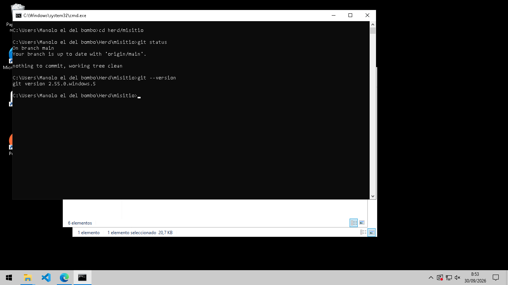
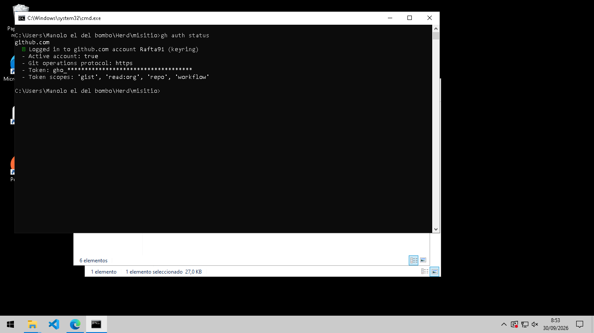
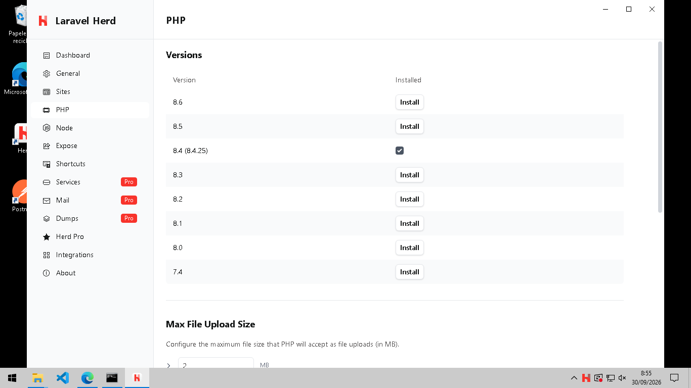
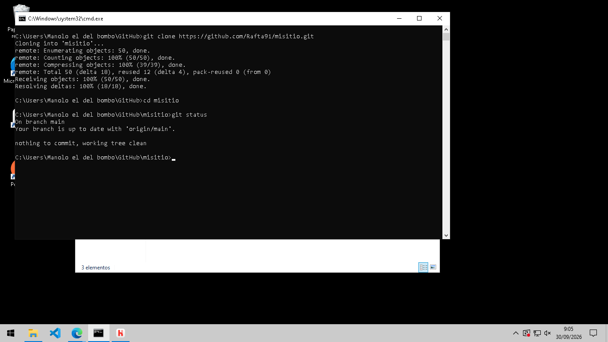
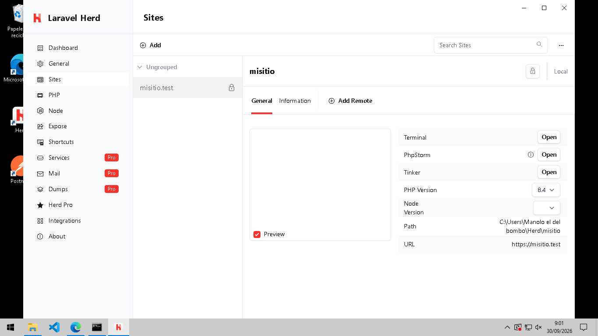

# Documentación proyecto26/27

## Práctica 01

- Captura de la instalación de Git: 

- GitHub CLI instalado y configurado: 

- Herd instalado con la versión de PHP 8.4: 

- repositorio `misitio` clonado en local: 

- Herd enlazado al repositorio `misitio` y sirviéndolo en `HTTPS`: 

He utilizado como tema de visualización `readthedocs`.